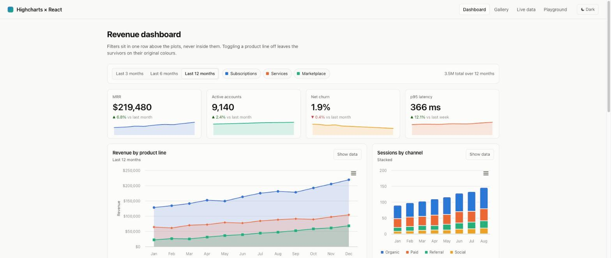
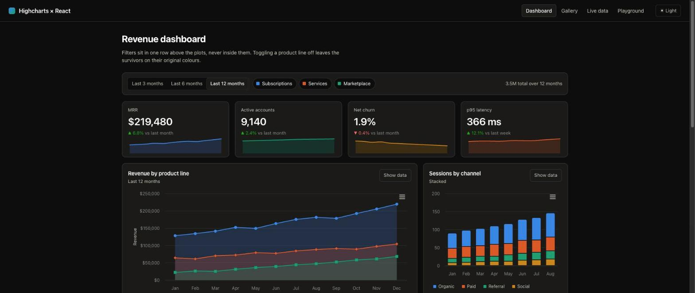
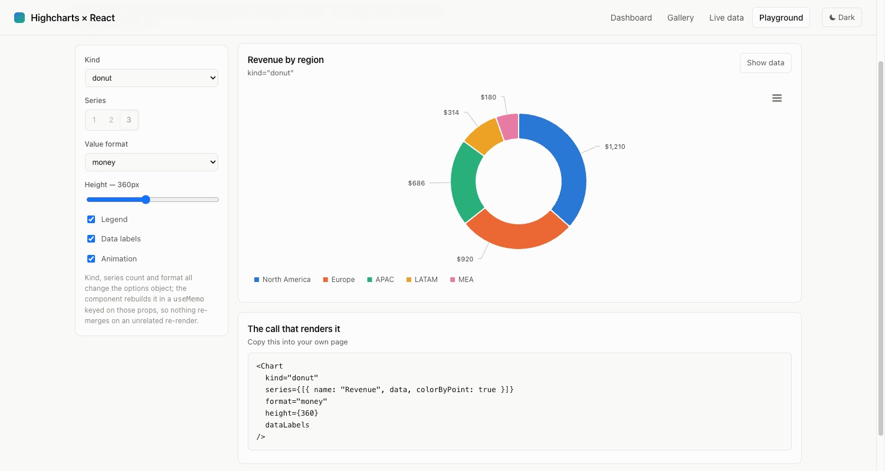
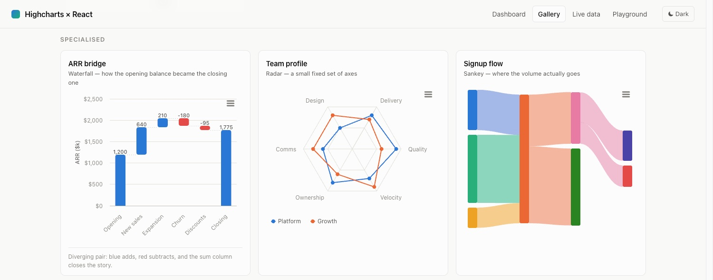
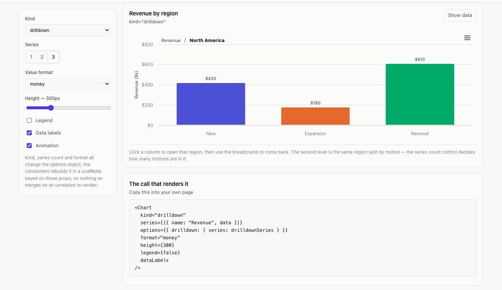
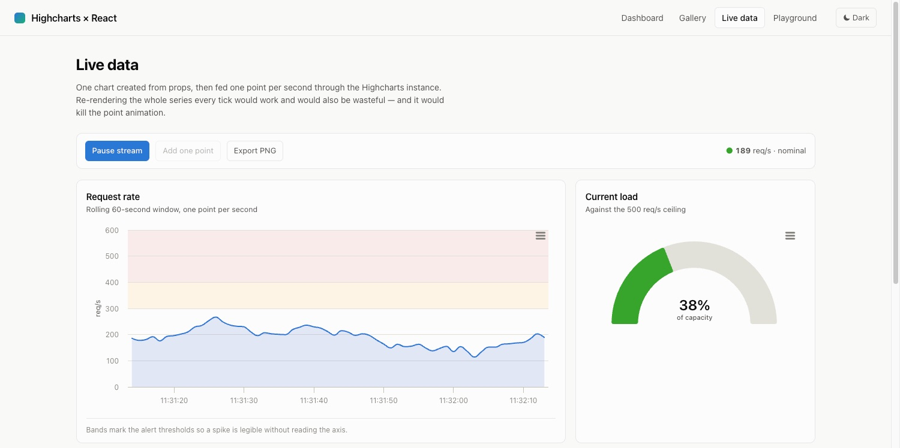

# Highcharts × React — practice project

A sample React app (plain JavaScript, no TypeScript) built around **one reusable
`<Chart />` component** that renders every chart type from the same props.

```bash
npm install
npm run dev      # http://localhost:5173
npm run build
npm run lint
```

Vite 8 · React 19 · Highcharts 13 · `highcharts-react-official`.

| Light | Dark |
|---|---|
|  |  |

Same charts, same slots, two palettes. Dark mode is *selected*, not inverted —
the same eight hues re-stepped for a dark surface and validated against it.

---

## The idea

Wrapping Highcharts once, properly, is worth more than sprinkling
`<HighchartsReact>` through twenty files. Theming, accessibility, resize
handling, number formatting and tooltip markup get solved a single time.

`src/components/Chart.jsx` composes options in five layers, each one able to
override the one below it:

| # | Layer | Lives in |
|---|-------|----------|
| 1 | global defaults (locale, credits, modules) | `src/highcharts/setup.js` |
| 2 | theme for the active light/dark mode | `src/highcharts/theme.js` |
| 3 | preset for the requested chart kind | `src/highcharts/presets.js` |
| 4 | convenience props (`title`, `categories`, `format`, …) | `Chart.jsx` |
| 5 | the `options` escape hatch — raw Highcharts | your call site |

Layer 5 is the important one. No wrapper can anticipate every Highcharts
option, and a wrapper you cannot override is a wrapper people abandon.

## Using it

```jsx
import Chart from './components/Chart';

<Chart
  kind="stacked-column"
  categories={['Q1', 'Q2', 'Q3', 'Q4']}
  series={[
    { name: 'New',       colorIndex: 0, data: [420, 310, 260, 120] },
    { name: 'Expansion', colorIndex: 2, data: [180, 140,  96,  44] },
  ]}
  format="money"
  yTitle="Revenue"
/>
```



The Playground puts one dataset through sixteen forms and prints the call that
rendered it — flip a control and watch the corresponding prop appear.

Anything not covered by a prop goes through untouched:

```jsx
<Chart
  kind="column"
  series={series}
  options={{
    xAxis: { plotBands: [{ from: 2.5, to: 3.5, color: 'rgba(0,0,0,.04)' }] },
    plotOptions: { column: { pointPadding: 0 } },
  }}
/>
```

### Props

| Prop | Meaning |
|---|---|
| `kind` | preset name (`line`, `donut`, `heatmap`, `gauge`, `combo`, …) or any raw Highcharts series type |
| `series` / `data` | series array, or a bare array for a single series |
| `categories`, `xType`, `xTitle`, `yTitle`, `yMin`, `yMax` | axis shorthands |
| `format`, `digits`, `valueSuffix` | `number` \| `compact` \| `money` \| `percent`; used by the axis, the tooltip and the table view together |
| `stacking`, `inverted`, `polar` | pass-throughs |
| `legend` | `true` / `false` / a Highcharts legend object; defaults to on for ≥ 2 series and for part-to-whole charts |
| `dataLabels`, `sharedTooltip`, `animation`, `exporting`, `height` | display switches |
| `onPointClick`, `onSeriesToggle` | event callbacks |
| `options` | raw Highcharts options, deep-merged last |
| `ref` | `{ chart, reflow(), exportPNG() }` |

### Chart kinds

`line` · `spline` · `area` · `areaspline` · `stacked-area` · `column` ·
`stacked-column` · `percent-column` · `bar` · `stacked-bar` · `pie` · `donut` ·
`scatter` · `bubble` · `heatmap` · `treemap` · `gauge` · `funnel` · `radar` ·
`streamgraph` · `sankey` · `dependencywheel` · `boxplot` · `waterfall` ·
`drilldown` · `sparkline` · `combo`

Unknown names fall through as a raw Highcharts series type, so nothing is
locked behind the preset table.



The Gallery page has one card per kind, grouped by the job the chart does —
change over time, comparison, composition, relationships, specialised. Every
card is the same component; only the props differ.

`drilldown` is a kind you click into. Points carry an id naming a series in
`options.drilldown.series`; Highcharts supplies the breadcrumb back:



## Layout

```
src/
  components/
    Chart.jsx           the reusable component
    ChartCard.jsx       heading + actions + "Show data" toggle
    DataTable.jsx       the table view behind that toggle
    StatTile.jsx        headline number + delta + sparkline
    ErrorBoundary.jsx   one broken chart must not blank the page
  highcharts/
    setup.js            module registration (all side-effect imports in one file)
    palette.js          colour tokens — categorical, sequential, diverging, status
    theme.js            light/dark Highcharts theme built from those tokens
    presets.js          chart kind → Highcharts config
  theme/                light/dark context, persisted, follows the OS until you choose
  hooks/useLiveSeries.js  streaming points through the chart instance
  pages/                Dashboard · Gallery · Live data · Playground
  utils/                deep merge + number formatting
```



The Live data page streams a point a second into a chart that was created once
from props. The bands mark the alert thresholds, and the gauge reads the same
number the status pill does.

## Things worth stealing

- **Modules are registered in one file.** Highcharts 12+ modules are
  side-effect imports (`import 'highcharts/modules/exporting'`). They must
  evaluate after Highcharts itself, so everything else imports Highcharts from
  `src/highcharts/setup.js` rather than from the package.
- **The theme is merged per chart, not set globally.**
  `Highcharts.setOptions()` only affects charts created *afterwards*, so a
  global theme leaves mounted charts on the old palette when the toggle flips.
- **Colour follows the entity, not its rank.** Series carry a stable
  `colorIndex`; filtering one out never repaints the survivors.
- **Every chart has a table view.** Some light-mode series colours sit below
  3:1 against the surface, so the numbers must also be readable as text.
- **`ResizeObserver` drives `chart.reflow()`.** Highcharts only listens to
  window resize; in a CSS grid a card changes width without the window moving.
- **Streaming uses `series.addPoint()`.** Pushing a new series array every
  second makes React rebuild options and Highcharts diff the lot — and it kills
  the point animation.
- **No dual-axis charts anywhere.** Two units in one frame is the most
  misread chart there is: use two charts, or index both to a common base.

## Licence

The code in this repo is MIT licensed — see [LICENSE](LICENSE).

That covers this repo's own code only. **Highcharts itself is not MIT**: it is a
commercial product, free for personal and non-commercial use, and a commercial
project needs a licence from [Highsoft](https://shop.highcharts.com/). Cloning
this repo does not grant you one.
